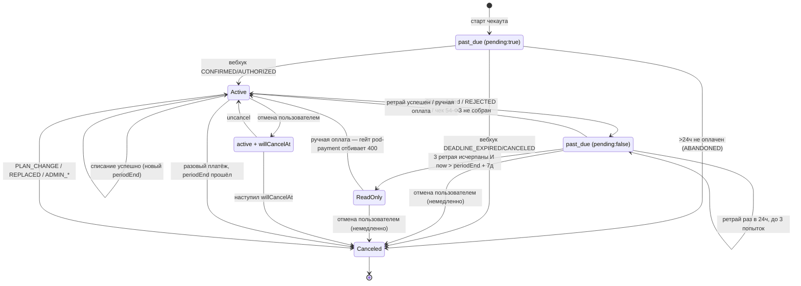

# Биллинг — статусы подписки и переходы между ними

> **Поддерживать в актуальном состоянии.** Этот документ — единственное место, где переходы собраны
> целиком; логика размазана по 4+ подам, и по коду её заново собирать дорого. Обновлять в **том же PR**,
> что и правку, не потом.
>
> Триггеры на обновление — правки в:
> - `pod-tbank-subscriptions/src/`: `server.ts` (`buildCanceledSubscriptionData`, `isImmediateCancel`,
>   `processWebhook`, `handleCancelSubscription`, `handleRetryPayment`), `scheduler.ts` (любой `upsert`
>   со сменой статуса), `storage.ts` (`needsRenewal`), `utils.ts` (`build*Subscription`)
> - `pod-payment/src/utils.ts` (`isFinalizedUserCancel`, `hasGrantingTier`), `main.ts` (free-fallback) и
>   `server.ts` (гейты статусов на ручках cancel/retry — они уже, чем в tbank-поде, см. §7)
> - `plugins/billing-resources/src/components/Subscriptions.svelte` (условия показа блоков/бейджей по
>   статусу: `isUnpaid`, past-due-блок, бейджи tier и package)
> - `foundations/core/packages/account-client/src/utils.ts` (`PLAN_GRANTING_STATUSES`, `grantsPlan`)
> - `server/account/src/serviceOperations.ts` (админские переходы, инвариант «одна активная tier»)
> - enum `SubscriptionStatus` в любом из 4 источников ниже + миграция Postgres ENUM
> - константы: `GRACE_PERIOD_DAYS`, `MAX_RETRY_ATTEMPTS`, `RETRY_INTERVAL_MS`, `MANUAL_RETRY_INTERVAL_MS`
>
> Быстрая самопроверка: `grep -rn "SubscriptionStatus\." --include=*.ts services/payment services/billing
> server/account foundations/core | grep -v __tests__` — каждая запись статуса должна быть в §2.
>
> Смежное: `docs/memory/tbank_api_spec.md` §Cancel semantics (детали отмены).

Статус — **персистентное поле** `subscription.status` (Postgres ENUM), не выводимое состояние. Но *эффективный* уровень доступа считается на каждом чтении из `(status, providerData.pending, trialEnd, willCancelAt)` — см. §1 и §5.

Источники истины (один Postgres ENUM + три дублирующих TS-объявления, значения совпадают):

| Источник | file:line |
|---|---|
| Postgres `ENUM subscription_status` (v19: 6 значений) | `server/account/src/collections/postgres/migrations.ts:673-680` |
| + `readonly` добавлен (v29, `ALTER TYPE ... ADD VALUE`) | `.../migrations.ts:873-892` |
| TS enum (серверный, схема) | `server/account/src/types.ts:234-242` |
| TS enum (клиентский SDK аккаунтов) | `foundations/core/packages/account-client/src/types.ts:182-190` |
| TS enum (payment-client) | `packages/payment-client/src/types.ts:25-33` |

Движок рекуррентных подписок: `services/payment/pod-tbank-subscriptions` (провайдер **tbank** — единственный рабочий). `pod-payment` — фасад провайдеров, Stripe/Polar оставлены для обратной совместимости.

---

## 1. Значения статуса

| Статус | Значение | Реально используется в tbank |
|---|---|---|
| `active` | оплачена, доступ полный | да |
| `trialing` | триал (бесплатное использование) | не в tbank-потоке, но выставляется при заведении воркспейса (`pod-payment/src/server.ts:322-356`) |
| `past_due` | платёж не прошёл, подписка не отменена — **grace, доступ полный** | да |
| `readonly` | grace истёк — доступ только чтение, долг остаётся | да |
| `canceled` | отменена пользователем/админом/системой | да |
| `paused` | временно приостановлена | нет — только маппинг Stripe (`pod-payment/src/providers/stripe/utils.ts:34`) |
| `expired` | подписка/триал истекли | нет — только чтение в UI (`plugins/billing-resources/src/stores/subscription.ts:109`) |

`past_due` расщепляется на **два разных состояния** по флагу `providerData.pending` (`services/payment/pod-tbank-subscriptions/src/utils.ts:127-133`):

- `isPendingFirstPayment` = `past_due` + `pending:true` — черновик первого платежа (чекаут начат, не подтверждён). Нет `rebillId`, нет реального периода. **Плана НЕ даёт.**
- `isFailedRenewal` = `past_due` + `pending:false` — реальный провал рекуррентного списания на ранее активной подписке. Есть `rebillId`, идёт grace. **План даёт.**

### Какие статусы дают тариф

`foundations/core/packages/account-client/src/utils.ts:27-42`:

```
PLAN_GRANTING_STATUSES = [Active, Trialing, PastDue, ReadOnly]
```

`grantsPlan()` поверх списка режет два случая:
- `past_due` + `providerData.pending === true` → не даёт (черновик неоплачен), `:38`
- `trialing` + `trialEnd < now` → не даёт, откат на free, `:40`

`canceled` / `expired` не дают план никогда. Проверка лимитов биллинга использует тот же набор (`services/billing/pod-billing/src/__tests__/limits.test.ts:35`: `['active','trialing','past_due','readonly']`).

Отсюда важное: **`readonly` тариф даёт** и **режима только-чтение по неоплате в коде НЕТ**. Проверено: строка `PaymentOverdueReadonly` не встречается в репозитории ни разу — ни продюсера, ни enforcement. Лимиты в `readonly` те же, что в `active`; единственный видимый эффект — бейдж «Не активен» в карточке тарифа (`Subscriptions.svelte:1095-1096`, `status-badge-disabled`).

Единственный работающий read-only — `SeatLimitsMiddleware` (`foundations/server/packages/middleware/src/seatLimits.ts:74-263`): участники сверх `usersLimit` получают отказ на запись, кроме разрешённых классов (`pods/server/src/limitsProvider.ts:113-131` — direct/chat/thread, `UserStatus`, presence/typing, `Preference`). Это ограничение по **числу мест**, не по неоплате.

Не путать три «readonly»: **A** seat-limit (работает) · **B** payment-overdue (мёртвый) · **C** роль `ReadOnlyGuest` (не про биллинг).

---

## 2. Переходы

### Появление подписки

| Из | В | Триггер | Место |
|---|---|---|---|
| — | `past_due` (`pending:true`, `providerData.status='PENDING'`) | создание черновика при старте чекаута, до оплаты | `server.ts:1206` (`buildSubscriptionData`) |

### Первая оплата

| Из | В | Триггер | Место |
|---|---|---|---|
| `past_due` (`pending:true`) | `active` | вебхук tbank `CONFIRMED` / `AUTHORIZED` | `server.ts:1248` |
| `past_due` (`pending:true`) | `canceled` (`providerData.status='ABANDONED'`, `pending:false`) | планировщик: черновик старше 24 ч не подтверждён | `scheduler.ts:325` (`cleanupAbandonedSubscriptions`) |
| `past_due` (`pending:true`) | `canceled` (`ABANDONED`) | вебхук `DEADLINE_EXPIRED` / `CANCELED` — ссылка протухла до оплаты; трогает **только** pending-черновик, активную подписку не задевает | `server.ts:1160-1177` |
| `active` (старая, того же типа) | `canceled` (`status='PLAN_CHANGE'`, `canceledAt=now`) | немедленная смена плана: sweep старой подписки по вебхуку `CONFIRMED` | `server.ts:1289-1300`, вызов `server.ts:1090-1098` |

Период и сумма при подтверждении берутся из черновика, не из вебхука (`server.ts:1250-1258`) — иначе пропорциональный апгрейд сбросил бы дальний `periodEnd`, а продление списало бы разовую дельту вместо полной цены.

### Продление (планировщик, каждые 60 мин)

`scheduler.ts`, `renewSubscription`. Интервал — `SCHEDULER_INTERVAL_MINUTES`, дефолт 60 (`config.ts:78`). Списание защищено кросс-подовым claim по периоду (`claimRenewal`, `scheduler.ts:81`) — одно списание на период даже при нескольких репликах.

| Из | В | Триггер | Место |
|---|---|---|---|
| `active` | `active` (новый `periodEnd`) | `Charge` успешен | `scheduler.ts:197-199` (`buildRenewedSubscription`) |
| `active` | `past_due` (`pending:false`, `status='CHARGE_FAILED'`) | `Charge` вернул ошибку | `scheduler.ts:214-219` → `utils.ts:384` |
| `active` | `past_due` (`status='CHARGE_ERROR'`) | неизвестный/транспортный исход, recheck не разрешил | `scheduler.ts:258-260` → `utils.ts:407` |
| `active` | `past_due` (`NO_RECEIPT_CONTACT` / `RECEIPT_BUILD_FAILED`) | чек по 54-ФЗ не собрался — **списание не выполняется вообще** | `scheduler.ts:154-160` |
| `past_due` | `past_due` (`retryAttempt+1`) | повторная попытка тоже не прошла | `utils.ts:381-384` |
| `past_due` | `active` | повторная попытка прошла | `scheduler.ts:197-199` |

Ретраи: `MAX_RETRY_ATTEMPTS = 3` (`scheduler.ts:48`), `RETRY_INTERVAL_MS = 24 ч` (`scheduler.ts:50`). Счётчик и время следующей попытки — в `providerData.retryAttempt` / `retryAfter`.

Кого планировщик вообще берёт в работу — `SubscriptionStorage.needsRenewal` (`storage.ts:164-184`):

```
recurrent === false                                    -> false (разовый платёж)
rebillId === undefined                                 -> false (нечем списывать)
willCancelAt != null && periodEnd >= willCancelAt       -> false (запланирована отмена)
status === Active                                      -> periodEnd <= now
isFailedRenewal (past_due, pending:false)              -> retryAttempt < 3 && retryAfter <= now
иначе                                                  -> false
```

Отсюда: `readonly` под продление **не попадает** — выйти из него можно ручной оплатой либо отменой.

При транспортной ошибке исход перепроверяется через `CheckOrder` (`scheduler.ts:230-233`); если так и неизвестен — intent остаётся `pending`, его heartbeat выдыхается, и другой тик/под добивает его через захват по истёкшему lease (fail-safe в сторону «оплачено»), `scheduler.ts:253-257`.

### Grace → только чтение

| Из | В | Триггер | Место |
|---|---|---|---|
| `past_due` (`pending:false`) | `readonly` (`status='GRACE_EXPIRED'`) | `retryAttempt >= 3` **и** `now > periodEnd + GracePeriodDays` | `scheduler.ts:374` (`enforceGracePeriod`) |

Grace = `GRACE_PERIOD_DAYS`, дефолт **7 дней** (`config.ts:80`), считается **от `periodEnd`**, не от первого провала. Оба условия обязательны: не исчерпав 3 ретрая, подписка в `readonly` не уйдёт даже спустя недели. Черновики первого платежа (`pending:true`) сюда не попадают — их закрывает `cleanupAbandonedSubscriptions`.

**Из `readonly` автоматических переходов нет.**

- Три sweep-а планировщика, ставящих `canceled`, требуют `active`: `cleanupAbandoned` (`:325`, только pending-черновики), `expireOneOffSubscriptions` (`:421`), `enforceScheduledCancel` (`:475`). `readonly` не берёт ни один.
- Free-подписка создаётся только через `isFinalizedUserCancel` (`pod-payment/main.ts:163`) по паре `(Tier, Canceled, 'CANCELED')` — сама в `canceled` запись не приходит, значит и отката на free не происходит.
- `readonly` входит в `PLAN_GRANTING_STATUSES` → лимиты тарифа продолжают выдаваться, без ограничений по времени (энфорсинга нет, см. §7).
- Ручная оплата из `readonly` не проходит: `handleRetryPayment` в tbank-поде её допускает (`server.ts:868`), но фасад `pod-payment` пропускает только `past_due` (`server.ts:1024`) → 400. UI кнопку в `readonly` тоже не рисует (`Subscriptions.svelte:1254` — жёстко `=== 'past_due'`). Автоматический ретрай мимо: `needsRenewal` заходит в ретрай-ветку через `isFailedRenewal` (= `past_due` + `pending:false`).

Единственный выход из `readonly` — **отмена пользователем**: запись уходит в `canceled` сразу, и `pod-payment` заводит free (см. §Отмена). До FUSIO-1099 отмена в `past_due`/`readonly` возвращала ошибку.

### Погашение долга вручную

| Из | В | Триггер | Место |
|---|---|---|---|
| `past_due` | `active` | ручка retry-payment (пользователь платит с восстановившейся карты) | `server.ts:848-870` (`handleRetryPayment`) |
| ~~`readonly`~~ | — | tbank-под допускает (`server.ts:868`), но фасад `pod-payment` отбивает 400 (`server.ts:1024`, гейт только `past_due`), и UI кнопку не рисует — см. §Grace → только чтение | `pod-payment/src/server.ts:1024` |

Любой другой статус → `400 'Subscription is not in a retryable status'`. Нужен `rebillId`, иначе `400 'No recurring payment method available'`. Неудача ручного ретрая тоже инкрементит `retryAttempt` с back-off `MANUAL_RETRY_INTERVAL_MS = 1 ч` (`server.ts:66`, использование `:900`, `:914`) — то есть ручные попытки расходуют тот же лимит из 3, что и автоматические.

### Отмена

Ветвление — в `buildCanceledSubscriptionData` (`server.ts`). Определяется **статусом на момент отмены**, не типом подписки.

| Из | В | Триггер | Место |
|---|---|---|---|
| `active` (оплаченная) | `active` + `canceledAt=now`, `willCancelAt=periodEnd`, `status='SCHEDULED_CANCEL'` | пользователь отменяет — **cancel-at-period-end**, доступ до конца периода | `server.ts` (ветка по умолчанию) |
| `past_due` / `readonly` (неоплаченная) | `canceled` **сразу** + `canceledAt=now`, `willCancelAt=undefined`, `status='CANCELED'` | пользователь отменяет — `isImmediateCancel`; карта снимается тут же, dunning-поля (`retryAttempt`/`retryAfter`/`pending`) удаляются | `server.ts` (`isImmediateCancel`) |
| `active` (+`willCancelAt<=now`) | `canceled` (`status='CANCELED'`) | планировщик по достижении `willCancelAt`; карта отвязывается | `scheduler.ts:475` |
| `active` (`recurrent:false`) | `canceled` + `canceledAt`, `status='CANCELED'` | разовый платёж: `periodEnd <= now` | `scheduler.ts:421` (`expireOneOffSubscriptions`) |

Отмена оплаченной **не снимает доступ сразу** — статус остаётся `active` до конца периода, `willCancelAt` блокирует продление. Uncancel очищает `willCancelAt`; планировщик перечитывает запись перед записью, чтобы не переехать поверх uncancel (`scheduler.ts:465-471`).

Почему неоплаченные отменяются иначе: у них `periodEnd` уже в прошлом, поэтому scheduled-ветка оставила бы запись **`active` с истёкшим периодом** → `grantsPlan` отдаёт платный тариф бесплатно, `enforceGracePeriod` её не подберёт (`isFailedRenewal` требует `past_due`), а `enforceScheduledCancel` подберёт лишь на следующем тике (окно до 60 мин). Отсюда немедленный `canceled`.

`providerData.status === 'CANCELED'` — точное значение, по которому `pod-payment` включает откат на бесплатный тариф. Условие — **пара** `(status=Canceled, providerData.status='CANCELED')` **и** `type === Tier` (`isFinalizedUserCancel`, `pod-payment/src/utils.ts:44-50`). `SCHEDULED_CANCEL`/`ABANDONED`/`REPLACED`/`PLAN_CHANGE` не триггерят free. Отмена `package` free-подписку не создаёт (условие требует `type === Tier`), и уже оплаченный package остаётся `active` до конца своего периода даже после ухода tier на free — `isPackageEligible` проверяется только при смене package (`pod-payment/src/server.ts:769-778`).

### Вебхуки tbank → статус

| Событие | Действие | Место |
|---|---|---|
| `CONFIRMED`, `AUTHORIZED` | → `active` (первая оплата / подтверждение) | `server.ts:1248` |
| `REJECTED`, `REVERSED`, `REFUNDED` | → `past_due` (`pending:false`, `retryAttempt:0`, `retryAfter = now + 1 ч`) — **не отмена**, карта и `rebillId` сохраняются для ретрая | `server.ts:1136` |

Идемпотентность терминальных вебхуков: если на не-pending `past_due` уже записан ровно этот `Status`, повтор пропускается — иначе только сбросился бы `retryAfter` и ушло дублирующее письмо (`server.ts:1121-1127`).

Полный enum вебхук-статусов tbank — `types.ts:49`: `AUTHORIZED, CONFIRMED, REJECTED, REVERSED, REFUNDED, DEADLINE_EXPIRED, CANCELED`.

### Административные переходы (`server/account/src/serviceOperations.ts`)

Все требуют OTP-подтверждения админа.

| Из | В | Триггер | Место |
|---|---|---|---|
| любой (кроме `canceled`) | `canceled` (`ADMIN_CANCELED`, `pending:false`, `canceledAt`) | админская отмена; для `type=tier` публикует `limitsChanged` | `serviceOperations.ts:441-474` |
| любой | старая → `canceled` (`ADMIN_EDITED`), создаётся новая запись | админская правка seats/`periodEnd` (supersede, не in-place) | `serviceOperations.ts:344-376`, вызов `:378-439` |
| любой не-`canceled` того же типа | `canceled` (`ADMIN_REPLACED`) | админ создаёт новую подписку того же типа | `serviceOperations.ts:1955-1977` |

### Инвариант «не более одной активной tier-подписки»

`serviceOperations.ts:1540-1561` (`upsertSubscription`): при записи `type=tier` + `status=active` все прочие tier-подписки воркспейса в `active`/`trialing` принудительно переводятся в `canceled` (`status='REPLACED'`, `canceledAt=now`). Срабатывает на **любом** upsert — из вебхука, планировщика, free-fallback. То есть переход в `canceled` может произойти как побочный эффект записи другой подписки, а не по явной отмене.

### Создание при заведении воркспейса (`pod-payment`)

| В | Триггер | Место |
|---|---|---|
| `trialing` | заведение воркспейса, если сконфигурен trial-план | `pod-payment/src/server.ts:322-356` |
| `active` (`provider='free'`) | заведение воркспейса без триала, либо откат на free после финализированной пользовательской отмены | `pod-payment/src/server.ts:371-400` |

Поэтому `trialing` **достижим** — но не через tbank-поток, а только при создании воркспейса.

---

## 3. Три разных перехода в `canceled` — не путать

| Место | Смысл | `providerData.status` |
|---|---|---|
| `scheduler.ts:325` | брошенный черновик первого платежа (>24 ч) | `ABANDONED` |
| `scheduler.ts:421` | разовая покупка отработала свой период | `CANCELED` |
| `scheduler.ts:475` | наступил запланированный `willCancelAt` | `CANCELED` |

Только `:421` и `:475` ставят `canceledAt`; `ABANDONED` — нет, там платежа не было.

---

## 4. Уведомления по переходам

`notifyRenewalFailure` (`scheduler.ts:282-296`):

- письмо `'failed'` — на первом провале цикла, т.е. именно на переходе `active → past_due` (флаг `wasActive`, `scheduler.ts:72`);
- письмо `'final'` — один раз, когда `retryAttempt` достиг максимума;
- повторные ретраи внутри `past_due` писем не рождают.

Успешное продление → `notifyPaymentSucceeded(..., 'renewal')` с чеком (`scheduler.ts:206`). Блокировка чека по 54-ФЗ → `notifyReceiptBlocked`, операционный алерт команде на **каждое** срабатывание (`scheduler.ts:167`).

---

## 5. Отображение и enforcement

- `plugins/billing-resources/src/stores/subscription.ts:108-109` — `readonly` и `expired` сворачиваются в одно состояние UI.
- `plugins/billing-resources/src/components/Subscriptions.svelte:797` — `readonly` в `DISPLAY_STATUS_PRIORITY` (запись показывается как требующая внимания); `:1095-1096` — бейдж «Не активен» (`status-badge-disabled`) для tier. Для `package` такой ветки нет: бейдж рисуется только при `status === 'active'` (`:1198`), при `past_due`/`readonly` он пропадает без замены.
- `plugins/admin-resources/src/components/tabs/PaymentsTab.svelte:172`, `:262` — админка объединяет `past_due` и `readonly` в «Подписка просрочена».
Лимиты по статусам:

| Статус | Даёт план | Фактические лимиты |
|---|---|---|
| `active`, `trialing` (живой), `past_due` (grace, `pending:false`) | да | лимиты тарифа |
| `readonly` | да | **те же, что active** — отдельного enforcement нет |
| `past_due` (`pending:true`), `canceled`, `expired`, `paused` | нет | free-лимиты последнего tier, иначе `ZERO_LIMITS` = безлимит (**fail-open**) |

`pods/server/src/limitsProvider.ts:91-105` (`getPlanLimits`): читает подписки с `activeOnly=false` (неоплаченный tier всё равно несёт нужный free-fallback), берёт **новейший** грантящий tier — не первый `active`, т.к. две `active`-строки могут кратко пересекаться. `catch` → `ZERO_LIMITS`, то есть сбой аккаунт-сервиса тоже открывает лимиты.

Free-лимиты не хранятся на записи, а проставляются на каждом чтении (`server/account/src/operations.ts:2919-2922`, `freeLimits.ts:63-65`). Читатели `grantsPlan`: `pod-billing/src/limits.ts:269`, `usage.ts:183`, `pod-payment/src/utils.ts:57-58`, `plugins/billing-resources/src/utils.ts:135-136,167-168`.

---

## 6. Схема



В tbank-потоке недостижимы `paused` и `expired`. `trialing` приходит только из `pod-payment` при заведении воркспейса. Ребро `ReadOnly --> Active` реализовано в tbank-поде, но недостижимо через фасад — единственный работающий выход из `ReadOnly` идёт через отмену.

---

## 7. Известные квирки

- Grace считается от `periodEnd`, а ретраи — от момента провала. Если первый провал случился заметно позже `periodEnd`, оба условия могут выполниться почти одновременно и grace фактически сожмётся.
- **`readonly` ничего не ограничивает и никуда не ведёт.** Блокировки записи по неоплате в коде нет: строка `PaymentOverdueReadonly` лежит в 12 локалях и не используется нигде. План продолжает выдаваться, автоперехода на free нет, оплатой из статуса не выйти.
- **`past_due` перегружен**: черновик первой оплаты и провал продления — одно значение статуса, различаются только флагом `providerData.pending`. Ветвление по `past_due` без проверки `pending` затрагивает оба случая сразу.
- `REFUNDED`/`REVERSED` обрабатываются как `REJECTED` → уходят в `past_due` с ретраем, хотя деньги уже возвращены.
- Ручной ретрай расходует тот же лимит из 3 попыток, что и автоматический — исчерпав его вручную, пользователь ускоряет уход в `readonly`, откуда оплатой уже не выберется.
- Гейты retry в фасаде и tbank-поде расходятся: `pod-payment/src/server.ts:1024` пропускает только `past_due`, `pod-tbank-subscriptions/src/server.ts:868` — `past_due` и `readonly`.
- Просроченный `package` в UI не отображается: бейдж «Активен» рисуется по `status === 'active'` (`Subscriptions.svelte:1198`) и при `past_due` пропадает, футер продолжает показывать «Продление: {дата}» (`:1226`), кнопки retry для пакета нет — блок `:1254` завязан на tier.
- Переход в `canceled` может случиться без явной отмены — побочный эффект инварианта «одна активная tier» (`REPLACED`, `serviceOperations.ts:1540-1561`).
- `getPlanLimits` при отсутствии free-лимитов и при исключении отдаёт `ZERO_LIMITS` = безлимит. Отвал аккаунт-сервиса **открывает** лимиты, не закрывает.
- Комментарий в `scheduler.ts` рядом с ретраями называет интервал «1-hour», по факту `RETRY_INTERVAL_MS` = 24 ч.
- Free-план в конфиге необязателен: `freePlanName` (`pod-payment/src/server.ts:272-274`) ищется по флагу `free: true` и может быть `undefined`. Тогда `createFreeIfNoActiveTier:361` выходит сразу без лога, откат на free не происходит, а новый воркспейс остаётся без tier-подписки.
