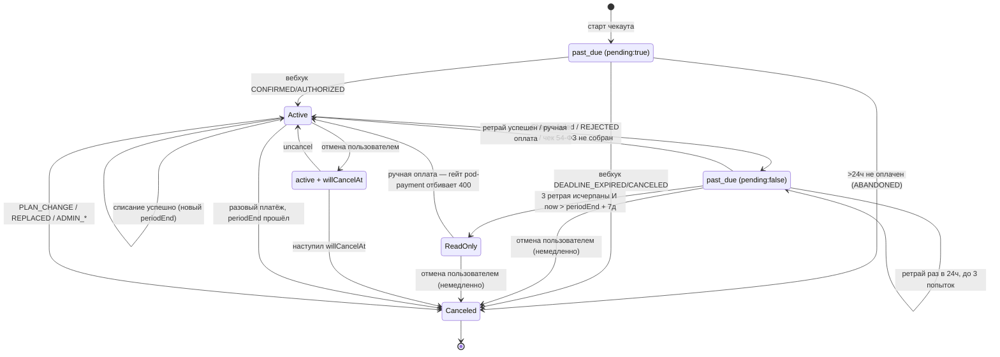

# Биллинг - статусы подписки и переходы между ними

Область: [Биллинг](features/billing.md)

Единственное место, где переходы между статусами подписки собраны целиком - логика размазана по 4+ подам. Смежное: [T-Bank API spec](memory/tbank_api_spec.md) (детали отмены).

Статус - персистентное поле `subscription.status` (Postgres ENUM), не выводимое состояние. Но эффективный уровень доступа считается на каждом чтении из `(status, providerData.pending, trialEnd, willCancelAt)` - см. §1 и §5.

Источники истины - один Postgres ENUM и три дублирующих TS-объявления с одинаковыми значениями: тип `subscription_status` (`server/account/src/collections/postgres/migrations.ts`, значение `readonly` добавлено отдельной более поздней миграцией через `ALTER TYPE ... ADD VALUE`), `enum SubscriptionStatus` в `server/account/src/types.ts`, в `foundations/core/packages/account-client/src/types.ts` и в `packages/payment-client/src/types.ts`.

Движок рекуррентных подписок - `services/payment/pod-tbank-subscriptions` (провайдер tbank). `pod-payment` - фасад провайдеров: Stripe и Polar реализованы полностью (реальные вызовы SDK, верификация вебхуков, свои тесты в `providers/{stripe,polar}/__tests__/`), но не включены ни в одном деплое репозитория - везде задан `PROVIDER=tbank` или `PROVIDER=mock` (`services/payment/pod-payment/src/config.ts`, `PROVIDER` - обязательный ключ без дефолта).

---

## 1. Значения статуса

| Статус | Значение | Реально используется в tbank-потоке |
|---|---|---|
| `active` | оплачена, доступ полный | да |
| `trialing` | триал (бесплатное использование) | не в tbank-потоке, выставляется при заведении воркспейса |
| `past_due` | платёж не прошёл, подписка не отменена - grace, доступ полный | да |
| `readonly` | grace истёк - доступ только чтение, долг остаётся | да |
| `canceled` | отменена пользователем/админом/системой | да |
| `paused` | временно приостановлена | нет - только маппинг у провайдера Stripe |
| `expired` | подписка/триал истекли | нет - только чтение в UI |

`past_due` расщепляется на два разных состояния по флагу `providerData.pending` (`isPendingFirstPayment`/`isFailedRenewal`, `services/payment/pod-tbank-subscriptions/src/utils.ts`):

- `isPendingFirstPayment` = `past_due` + `pending:true` - черновик первого платежа (чекаут начат, не подтверждён). Нет `rebillId`, нет реального периода. Плана не даёт.
- `isFailedRenewal` = `past_due` + `pending:false` - реальный провал рекуррентного списания на ранее активной подписке. Есть `rebillId`, идёт grace. План даёт.

### Какие статусы дают тариф

`PLAN_GRANTING_STATUSES = [Active, Trialing, PastDue, ReadOnly]` (`foundations/core/packages/account-client/src/utils.ts`). `grantsPlan()` поверх списка режет два случая: `past_due` с `providerData.pending === true` (черновик неоплачен) и `trialing` с истёкшим `trialEnd` (откат на free). `canceled`/`expired` не дают план никогда. Проверка лимитов биллинга использует тот же набор статусов (`services/billing/pod-billing/src/__tests__/limits.test.ts`).

Отсюда важное: `readonly` тариф даёт, и режима только-чтение по неоплате в коде нет. Строка `PaymentOverdueReadonly` объявлена в lang-файлах всех локалей `plugins/billing-assets/lang/*.json`, но не используется ни в одном `.ts`/`.svelte` файле репозитория. Лимиты в `readonly` те же, что в `active`; единственный видимый эффект - бейдж "Не активен" в карточке тарифа (`status-badge-disabled`, `plugins/billing-resources/src/components/Subscriptions.svelte`).

Единственный работающий read-only - `SeatLimitsMiddleware` (`foundations/server/packages/middleware/src/seatLimits.ts`): участники сверх `usersLimit` получают отказ на запись, кроме разрешённых классов (`pods/server/src/limitsProvider.ts` - direct/chat/thread, `UserStatus`, presence/typing, `Preference`). Это ограничение по числу мест, не по неоплате.

Не путать три "readonly": **A** seat-limit (работает) - **B** payment-overdue (мёртвый код) - **C** роль `ReadOnlyGuest` (не про биллинг).

---

## 2. Переходы

### Появление подписки

| Из | В | Триггер | Место |
|---|---|---|---|
| - | `past_due` (`pending:true`, `providerData.status='PENDING'`) | создание черновика при старте чекаута, до оплаты | `pod-tbank-subscriptions/src/server.ts` (`buildSubscriptionData`) |

### Первая оплата

| Из | В | Триггер | Место |
|---|---|---|---|
| `past_due` (`pending:true`) | `active` | вебхук tbank `CONFIRMED` / `AUTHORIZED` | `server.ts` (ветка `Status === 'CONFIRMED'`, вызывает `buildSubscriptionDataFromWebhook`) |
| `past_due` (`pending:true`) | `canceled` (`providerData.status='ABANDONED'`, `pending:false`) | планировщик: черновик старше 24 ч не подтверждён | `scheduler.ts` (`cleanupAbandonedSubscriptions`) |
| `past_due` (`pending:true`) | `canceled` (`ABANDONED`) | вебхук `DEADLINE_EXPIRED` / `CANCELED` - ссылка протухла до оплаты; трогает только pending-черновик, активную подписку не задевает | `server.ts` (обработка терминальных статусов вебхука) |
| `active` (старая, того же типа) | `canceled` (`status='PLAN_CHANGE'`, `canceledAt=now`) | немедленная смена плана: sweep старой подписки по вебхуку `CONFIRMED` | `server.ts` |

Период и сумма при подтверждении берутся из черновика, не из вебхука - иначе пропорциональный апгрейд сбросил бы дальний `periodEnd`, а продление списало бы разовую дельту вместо полной цены.

### Продление (планировщик, каждые `SCHEDULER_INTERVAL_MINUTES`, дефолт 60)

`scheduler.ts`, `renewSubscription`. Списание защищено кросс-подовым claim по периоду (`claimRenewal`) - одно списание на период даже при нескольких репликах.

| Из | В | Триггер | Место |
|---|---|---|---|
| `active` | `active` (новый `periodEnd`) | `Charge` успешен | `scheduler.ts` (`buildRenewedSubscription`) |
| `active` | `past_due` (`pending:false`, `status='CHARGE_FAILED'`) | `Charge` вернул ошибку | `scheduler.ts`, `utils.ts` |
| `active` | `past_due` (`status='CHARGE_ERROR'`) | неизвестный/транспортный исход, recheck не разрешил | `scheduler.ts`, `utils.ts` |
| `active` | `past_due` (`NO_RECEIPT_CONTACT` / `RECEIPT_BUILD_FAILED`) | чек по 54-ФЗ не собрался - списание не выполняется вообще | `scheduler.ts` |
| `past_due` | `past_due` (`retryAttempt+1`) | повторная попытка тоже не прошла | `utils.ts` |
| `past_due` | `active` | повторная попытка прошла | `scheduler.ts` |

Ретраи: `MAX_RETRY_ATTEMPTS = 3`, `RETRY_INTERVAL_MS = 24 ч` (`scheduler.ts`). Счётчик и время следующей попытки - в `providerData.retryAttempt`/`retryAfter`.

Кого планировщик вообще берёт в работу - `SubscriptionStorage.needsRenewal` (`storage.ts`):

```
recurrent === false                                    -> false (разовый платёж)
rebillId === undefined                                 -> false (нечем списывать)
willCancelAt != null && periodEnd >= willCancelAt       -> false (запланирована отмена)
status === Active                                      -> periodEnd <= now
isFailedRenewal (past_due, pending:false)              -> retryAttempt < 3 && retryAfter <= now
иначе                                                  -> false
```

Отсюда: `readonly` под продление не попадает - выйти из него можно только ручной оплатой либо отменой.

При транспортной ошибке исход перепроверяется через `CheckOrder` (`scheduler.ts`); если так и неизвестен - intent остаётся `pending`, его heartbeat выдыхается, и другой тик/под добивает его через захват по истёкшему lease (fail-safe в сторону "оплачено").

### Grace -> только чтение

| Из | В | Триггер | Место |
|---|---|---|---|
| `past_due` (`pending:false`) | `readonly` (`status='GRACE_EXPIRED'`) | `retryAttempt >= 3` и `now > periodEnd + GracePeriodDays` | `scheduler.ts` (`enforceGracePeriod`) |

Grace = `GRACE_PERIOD_DAYS`, дефолт 7 дней, считается от `periodEnd`, не от первого провала. Оба условия обязательны: не исчерпав 3 ретрая, подписка в `readonly` не уйдёт даже спустя недели. Черновики первого платежа (`pending:true`) сюда не попадают - их закрывает `cleanupAbandonedSubscriptions`.

Из `readonly` автоматических переходов нет.

- Три sweep-а планировщика, ставящих `canceled`, требуют `active`: `cleanupAbandonedSubscriptions` (только pending-черновики), `expireOneOffSubscriptions`, `enforceScheduledCancel`. `readonly` не берёт ни один.
- Free-подписка создаётся только через `isFinalizedUserCancel` (`pod-payment/src/main.ts`) по паре `(Tier, Canceled, 'CANCELED')` - сама в `canceled` запись не приходит, значит и отката на free не происходит.
- `readonly` входит в `PLAN_GRANTING_STATUSES` - лимиты тарифа продолжают выдаваться, без ограничений по времени.
- Ручная оплата из `readonly` не проходит: `handleRetryPayment` в tbank-поде её допускает, но фасад `pod-payment` пропускает только `past_due` (`services/payment/pod-payment/src/server.ts`, ответ `400 'Subscription is not in past_due status'`) - UI кнопку в `readonly` тоже не рисует (жёсткая проверка `=== 'past_due'` в `Subscriptions.svelte`).

Единственный выход из `readonly` - отмена пользователем: запись уходит в `canceled` сразу, и `pod-payment` заводит free. До FUSIO-1099 отмена в `past_due`/`readonly` возвращала ошибку.

### Погашение долга вручную

| Из | В | Триггер | Место |
|---|---|---|---|
| `past_due` | `active` | ручка retry-payment (пользователь платит с восстановившейся карты) | `pod-tbank-subscriptions/src/server.ts` (`handleRetryPayment`) |
| `readonly` | - | tbank-под допускает статус в `handleRetryPayment`, но фасад `pod-payment` отбивает 400 (гейт только `past_due`), и UI кнопку не рисует - см. §Grace выше | `services/payment/pod-payment/src/server.ts` |

Любой другой статус -> `400 'Subscription is not in a retryable status'` (`pod-tbank-subscriptions/src/server.ts`). Нужен `rebillId`, иначе `400 'No recurring payment method available'`. Неудача ручного ретрая тоже инкрементит `retryAttempt` с back-off `MANUAL_RETRY_INTERVAL_MS = 1 ч` - ручные попытки расходуют тот же лимит из 3, что и автоматические.

### Отмена

Ветвление - в `buildCanceledSubscriptionData` (`pod-tbank-subscriptions/src/server.ts`). Определяется статусом на момент отмены, не типом подписки.

| Из | В | Триггер | Место |
|---|---|---|---|
| `active` (оплаченная) | `active` + `canceledAt=now`, `willCancelAt=periodEnd`, `status='SCHEDULED_CANCEL'` | пользователь отменяет - cancel-at-period-end, доступ до конца периода | `server.ts` (ветка по умолчанию) |
| `past_due` / `readonly` (неоплаченная) | `canceled` сразу + `canceledAt=now`, `willCancelAt=undefined`, `status='CANCELED'` | пользователь отменяет - `isImmediateCancel`; карта снимается тут же, dunning-поля удаляются | `server.ts` (`isImmediateCancel`) |
| `active` (+`willCancelAt<=now`) | `canceled` (`status='CANCELED'`) | планировщик по достижении `willCancelAt`; карта отвязывается | `scheduler.ts` (`enforceScheduledCancel`) |
| `active` (`recurrent:false`) | `canceled` + `canceledAt`, `status='CANCELED'` | разовый платёж: `periodEnd <= now` | `scheduler.ts` (`expireOneOffSubscriptions`) |

Отмена оплаченной не снимает доступ сразу - статус остаётся `active` до конца периода, `willCancelAt` блокирует продление. Uncancel очищает `willCancelAt`; планировщик перечитывает запись перед записью, чтобы не переехать поверх uncancel.

Почему неоплаченные отменяются иначе: у них `periodEnd` уже в прошлом, поэтому scheduled-ветка оставила бы запись `active` с истёкшим периодом - `grantsPlan` отдаёт платный тариф бесплатно, `enforceGracePeriod` её не подберёт (`isFailedRenewal` требует `past_due`), а `enforceScheduledCancel` подберёт лишь на следующем тике планировщика. Отсюда немедленный `canceled`.

`providerData.status === 'CANCELED'` - точное значение, по которому `pod-payment` включает откат на бесплатный тариф. Условие - пара `(status=Canceled, providerData.status='CANCELED')` и `type === Tier` (`isFinalizedUserCancel`, `services/payment/pod-payment/src/utils.ts`). `SCHEDULED_CANCEL`/`ABANDONED`/`REPLACED`/`PLAN_CHANGE` не триггерят free. Отмена `package` free-подписку не создаёт (условие требует `type === Tier`), и уже оплаченный package остаётся `active` до конца своего периода даже после ухода tier на free.

### Вебхуки tbank -> статус

| Событие | Действие | Место |
|---|---|---|
| `CONFIRMED`, `AUTHORIZED` | -> `active` (первая оплата / подтверждение) | `server.ts` |
| `REJECTED`, `REVERSED`, `REFUNDED` | -> `past_due` (`pending:false`, `retryAttempt`, `retryAfter = now + 1 ч`) - не отмена, карта и `rebillId` сохраняются для ретрая | `server.ts` |

Идемпотентность терминальных вебхуков: если на не-pending `past_due` уже записан ровно этот `Status`, повтор пропускается - иначе только сбросился бы `retryAfter` и ушло дублирующее письмо.

### Административные переходы (`server/account/src/serviceOperations.ts`)

Все требуют OTP-подтверждения админа.

| Из | В | Триггер | Место |
|---|---|---|---|
| любой (кроме `canceled`) | `canceled` (`ADMIN_CANCELED`, `pending:false`, `canceledAt`) | админская отмена; для `type=tier` публикует `limitsChanged` | `adminCancelSubscription`/`cancelSubscriptionRow` |
| любой | старая -> `canceled` (`ADMIN_EDITED`), создаётся новая запись | админская правка seats/`periodEnd` (supersede, не in-place) | `serviceOperations.ts` |
| любой не-`canceled` того же типа | `canceled` (`ADMIN_REPLACED`) | админ создаёт новую подписку того же типа | `serviceOperations.ts` |

### Инвариант "не более одной активной tier-подписки"

`upsertSubscription` (`server/account/src/serviceOperations.ts`): при записи `type=tier` + `status=active` все прочие tier-подписки воркспейса в `active`/`trialing` принудительно переводятся в `canceled` (`status='REPLACED'`, `canceledAt=now`). Срабатывает на любом upsert - из вебхука, планировщика, free-fallback. То есть переход в `canceled` может произойти как побочный эффект записи другой подписки, а не по явной отмене.

### Создание при заведении воркспейса (`pod-payment`)

| В | Триггер | Место |
|---|---|---|
| `trialing` | заведение воркспейса, если сконфигурен trial-план | `pod-payment/src/server.ts` (`createTrialSubscription`) |
| `active` (`provider='free'`) | заведение воркспейса без триала, либо откат на free после финализированной пользовательской отмены | `pod-payment/src/server.ts` (`createFreeIfNoActiveTier`) |

Поэтому `trialing` достижим - но не через tbank-поток, а только при создании воркспейса.

---

## 3. Три разных перехода в `canceled` - не путать

| Место | Смысл | `providerData.status` |
|---|---|---|
| `cleanupAbandonedSubscriptions` | брошенный черновик первого платежа (>24 ч) | `ABANDONED` |
| `expireOneOffSubscriptions` | разовая покупка отработала свой период | `CANCELED` |
| `enforceScheduledCancel` | наступил запланированный `willCancelAt` | `CANCELED` |

Только последние два ставят `canceledAt`; `ABANDONED` - нет, там платежа не было.

---

## 4. Уведомления по переходам

`notifyRenewalFailure` (`scheduler.ts`):

- письмо `'failed'` - на первом провале цикла, т.е. именно на переходе `active -> past_due`;
- письмо `'final'` - один раз, когда `retryAttempt` достиг максимума;
- повторные ретраи внутри `past_due` писем не рождают.

Успешное продление -> `notifyPaymentSucceeded(..., 'renewal')` с чеком. Блокировка чека по 54-ФЗ -> `notifyReceiptBlocked`, операционный алерт команде на каждое срабатывание.

---

## 5. Отображение и enforcement

`readonly` и `expired` сворачиваются в одно состояние UI (`plugins/billing-resources/src/stores/subscription.ts`). `readonly` в `DISPLAY_STATUS_PRIORITY` показывается как требующая внимания подписка, бейдж "Не активен" - только для tier (`Subscriptions.svelte`); для `package` такой ветки нет - бейдж рисуется только при `status === 'active'`, при `past_due`/`readonly` он пропадает без замены. Админка объединяет `past_due` и `readonly` в "Подписка просрочена" (`plugins/admin-resources/src/components/tabs/PaymentsTab.svelte`).

Лимиты по статусам:

| Статус | Даёт план | Фактические лимиты |
|---|---|---|
| `active`, `trialing` (живой), `past_due` (grace, `pending:false`) | да | лимиты тарифа |
| `readonly` | да | те же, что active - отдельного enforcement нет |
| `past_due` (`pending:true`), `canceled`, `expired`, `paused` | нет | free-лимиты последнего tier, иначе `ZERO_LIMITS` = безлимит (fail-open) |

`getPlanLimits` (`pods/server/src/limitsProvider.ts`) читает подписки с `activeOnly=false` (неоплаченный tier всё равно несёт нужный free-fallback), берёт новейший грантящий tier - не первый `active`, т.к. две `active`-строки могут кратко пересекаться. `catch` -> `ZERO_LIMITS`, то есть сбой аккаунт-сервиса тоже открывает лимиты.

Free-лимиты не хранятся на записи, а проставляются на каждом чтении (`server/account/src/operations.ts`, `freeLimits.ts`).

---

## 6. Схема



В tbank-потоке недостижимы `paused` и `expired`. `trialing` приходит только из `pod-payment` при заведении воркспейса. Ребро `ReadOnly -> Active` реализовано в tbank-поде, но недостижимо через фасад - единственный работающий выход из `ReadOnly` идёт через отмену.

---

## 7. Известные квирки

- Grace считается от `periodEnd`, а ретраи - от момента провала. Если первый провал случился заметно позже `periodEnd`, оба условия могут выполниться почти одновременно и grace фактически сожмётся.
- `readonly` ничего не ограничивает и никуда не ведёт. Блокировки записи по неоплате в коде нет: строка `PaymentOverdueReadonly` лежит в 12 локалях и не используется нигде. План продолжает выдаваться, автоперехода на free нет, оплатой из статуса не выйти.
- `past_due` перегружен: черновик первой оплаты и провал продления - одно значение статуса, различаются только флагом `providerData.pending`. Ветвление по `past_due` без проверки `pending` затрагивает оба случая сразу.
- `REFUNDED`/`REVERSED` обрабатываются как `REJECTED` -> уходят в `past_due` с ретраем, хотя деньги уже возвращены.
- Ручной ретрай расходует тот же лимит из 3 попыток, что и автоматический - исчерпав его вручную, пользователь ускоряет уход в `readonly`, откуда оплатой уже не выберется.
- Гейты retry в фасаде и tbank-поде расходятся: `pod-payment/src/server.ts` пропускает только `past_due`, `pod-tbank-subscriptions/src/server.ts` (`handleRetryPayment`) - `past_due` и `readonly`.
- Просроченный `package` в UI не отображается: бейдж "Активен" рисуется по `status === 'active'` и при `past_due` пропадает, футер продолжает показывать "Продление: {дата}", кнопки retry для пакета нет - этот блок завязан на tier.
- Переход в `canceled` может случиться без явной отмены - побочный эффект инварианта "одна активная tier" (`REPLACED`, `upsertSubscription`).
- `getPlanLimits` при отсутствии free-лимитов и при исключении отдаёт `ZERO_LIMITS` = безлимит. Отвал аккаунт-сервиса открывает лимиты, не закрывает.
- Комментарий в `scheduler.ts` рядом с ретраями называет интервал "1-hour", по факту `RETRY_INTERVAL_MS` = 24 ч.
- Free-план в конфиге необязателен: имя free-плана ищется по флагу `free: true` в `dev/plan-config.yaml` и может отсутствовать. Тогда `createFreeIfNoActiveTier` выходит сразу без лога, откат на free не происходит, а новый воркспейс остаётся без tier-подписки.

## Связанные документы

- [Биллинг](features/billing.md)
- [T-Bank API spec](memory/tbank_api_spec.md)
- [Billing limits enforcement](memory/billing-limits-enforcement.md)
