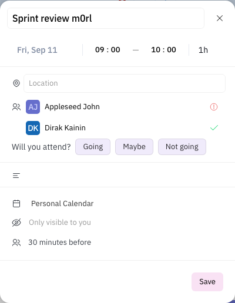

# Calendar RSVP - ответы участников на приглашение

Участник отвечает на приглашение **в своей копии события**, организатор видит
сводку на мастере. Копии лежат в личных пространствах владельцев, поэтому ни
один клиент не видит их все - счёт собирает сервер.

## Модель

| Поле `Event` | Где живёт | Смысл |
|---|---|---|
| `rsvp?: 'accepted' \| 'declined' \| 'tentative'` | только копия участника | его собственный ответ |
| `rsvpSummary?: { accepted, declined, tentative }` | только мастер | сводка, собранная сервером |

Копия создаётся триггером как `{ ...master, calendar, access, user }`
(`server-plugins/calendar-resources/src/index.ts:404`). Значит `participants` в
каждой копии **одинаков** - это список мастера; различает копии только `user`.
По нему и ключуется подсчёт (`collectRsvp`, `plugins/calendar/src/utils.ts:566`).

## Подсчёт на сервере

`rsvpSummaryTxes` (`server-plugins/calendar-resources/src/index.ts:308`)
перечитывает все копии по `eventId`, считает по одному ответу на `user`,
пропускает мастер (у него своего ответа нет) и пишет результат в `rsvpSummary`,
только если он изменился.

Пересчёт запускается в трёх местах:

1. участник записал `rsvp` в свою копию;
2. организатор сменил состав участников - копии ушедших удаляются в том же
   вызове, поэтому их `_id` передаются в пересчёт явно, иначе сводка успела бы
   посчитать уже несуществующий ответ;
3. участник удалил свою копию (`onRemoveEvent`).

## UI

`EventRsvp.svelte` в панели события. Участник видит три кнопки, текущий ответ
подсвечен:

Организатор вместо кнопок видит сводку: сколько идут, отказались, под вопросом,
и сколько ещё не ответили. Последнее считает `rsvpPending`, и **организатор из
этого числа вычитается**: он всегда в `participants` своего события, но себе не
отвечает - иначе «все ответили» было бы недостижимо.

Ответ на невыгруженное вхождение серии (`virtual: true`, `_id` генерируется на
лету) идёт через `updateReccuringInstance`: обычный `client.update` по такому
`_id` уходит в никуда.

## Тесты

- `plugins/calendar/src/__tests__/rsvp.test.ts` - подсчёт. Моки повторяют форму
  реальной копии: общий `participants`, разный `user`. Мок с `participants: [who]`
  делал тест зелёным при сломанном `collectRsvp`.
- `server-plugins/love-resources/src/__tests__/onEventUpdate.test.ts` - каскад
  мастер -> копии.
- `tests/sanity/tests/calendar/calendar-rsvp.spec.ts` - участник отвечает в своей
  копии, организатор видит счёт.
