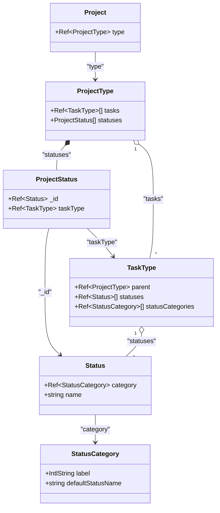

# Взаимосвязь сущностей Tracker (Project, ProjectType, TaskType, Status, StatusCategory)

В этом документе описывается структура и взаимосвязи ключевых сущностей таск-трекера Huly: проектов, их шаблонов, типов задач и статусов.

## 1. Описание сущностей

### Project (Проект)
* **Роль**: Конкретное рабочее пространство (пространство задач), созданное пользователем (например, «Разработка ядра», «Маркетинг»).
* **Связь с ProjectType**: Каждый проект жестко привязан к определенному типу проекта через поле `type: Ref<ProjectType>`.

### ProjectType (Тип проекта)
* **Роль**: Глобальный шаблон/конфигурация, определяющий структуру и поведение проектов этого типа (например, «Программная разработка», «CRM», «HR»).
* **Связь с TaskType**: Хранит список разрешенных типов задач для этого типа проекта в массиве `tasks: Ref<TaskType>[]`.
* **Связь со Status**: Содержит массив структур `ProjectStatus[]` в поле `statuses`. Каждая структура `ProjectStatus` привязывает конкретный статус (`_id: Ref<Status>`) к типу задачи (`taskType: Ref<TaskType>`) в рамках этого типа проекта.

### TaskType (Тип задачи)
* **Роль**: Определяет метаданные конкретного вида задач (например, «Bug», «Feature», «Task», «Candidate»).
* **Связь с ProjectType**: Ссылается на родительский тип проекта через `parent: Ref<ProjectType>`.
* **Связь со Status**: Жестко задает список доступных для данного типа задач статусов в массиве `statuses: Ref<Status>[]`.
* **Связь со StatusCategory**: Ссылается на разрешенные категории статусов через `statusCategories: Ref<StatusCategory>[]`.

### Status (Статус)
* **Роль**: Конкретный рабочий статус задачи (например, «New», «In Progress», «Testing», «Deployed»).
* **Связь со StatusCategory**: Каждый статус привязан к своей семантической категории через `category: Ref<StatusCategory>`.

### StatusCategory (Категория статуса)
* **Роль**: Системная группировка статусов по их смыслу (например, `Backlog`, `Todo`, `InProgress`, `Done`, `Closed`).
* **Зачем нужна**: Позволяет платформе понимать поведение задачи (например, является ли она завершенной или все еще активной), независимо от пользовательского названия статуса.

---

## 2. Схема взаимосвязей

